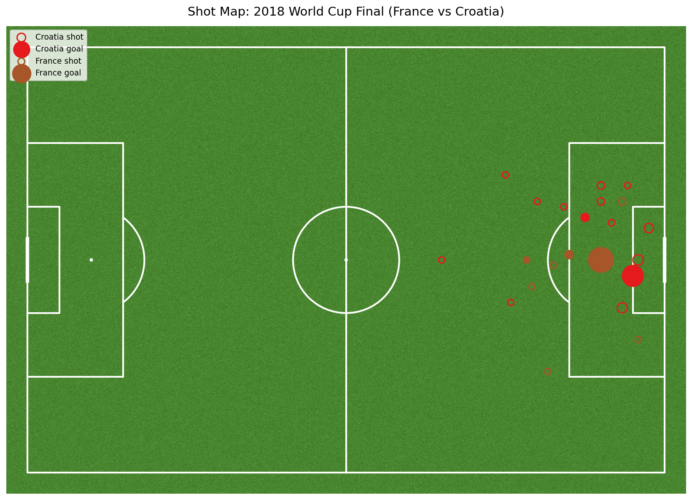
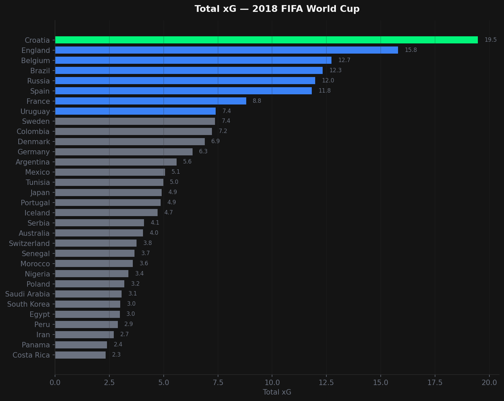
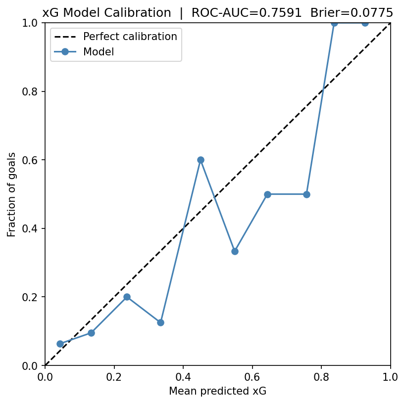
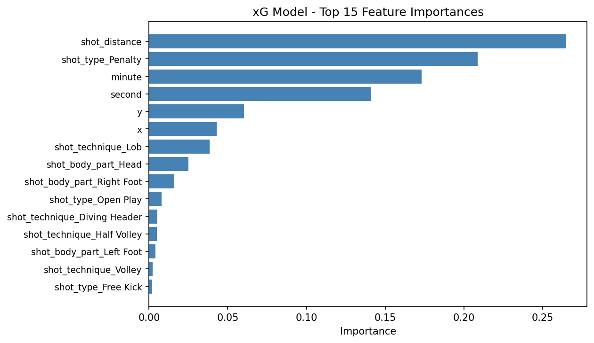

# ⚽ Football xG

[](https://football-xg-wgtdbkvmckwguz23munoxg.streamlit.app/)

A machine learning pipeline for football analytics built on **StatsBomb open data**.
It models the 2018 FIFA World Cup — all 64 matches, 32 teams, ~200,000 events — and answers two core questions:

> **1. How likely was each shot to be a goal? (xG)**
> **2. Can we predict match outcomes from team stats?**

---

## What is this project?

Modern football analysis goes beyond goals and assists. This project replicates the kind of tooling used by club analytics departments:

| Question | Model | Output |
|---|---|---|
| How dangerous was that shot? | **xG model** (Gradient Boosting) | Probability 0–1 per shot |
| Who should win this match? | **Outcome model** (Random Forest) | win / draw / loss |

Everything is built on **StatsBomb's free open data** — no paid subscription needed.

---

## Dashboard (Streamlit)

The easiest way to explore the project is the interactive dashboard:

```bash
pip install -e .
streamlit run app.py
```

This opens a browser with 5 pages:

| Page | What you see |
|---|---|
| **Overview** | Tournament summary, xG leaderboard, result distribution |
| **Shot Map** | Pick any match → see every shot on a pitch, sized by xG |
| **xG Model** | Calibration curve, feature importances, xG distribution |
| **Team Stats** | Compare any teams across possession, passing, pressing, xG |
| **Match Outcome Model** | Model accuracy, per-class precision/recall/F1 |

---

## Example outputs

### Shot Map — 2018 World Cup Final (France vs Croatia)

*Filled circles = goals. Marker size ∝ xG. France's large circle near the penalty spot = Griezmann's penalty.*

### Total xG per Team — Full Tournament

*Croatia and England generated the most chances. Costa Rica and Panama the fewest.*

### xG Model Calibration

*How well the model's probabilities match real goal rates. Closer to the dashed line = better.*

### Feature Importance

*Shot distance is the strongest predictor. Penalties are near-certain goals (~0.76 xG).*

---

## Quick start

```bash
# 1. Install
pip install -e .

# 2. Run the full pipeline (uses cached data — no download needed)
python -m football_ai.pipeline.run_experiment

# 3. Launch dashboard
streamlit run app.py
```

To download fresh data first:
```bash
python -m football_ai.pipeline.run_experiment --download
```

---

## Project structure

```
football-analytics-ai/
├── app.py                          ← Streamlit dashboard
├── src/football_ai/
│   ├── io/
│   │   ├── statsbomb_loader.py     ← Download StatsBomb events → CSV
│   │   └── data_writer.py          ← Save models, predictions, reports
│   ├── preprocessing/
│   │   ├── cleaning.py             ← Clean & parse raw events
│   │   └── feature_engineering.py  ← Team features, shot dataset builder
│   ├── modeling/
│   │   ├── models.py               ← Model registry (xg_gbm, outcome_rf, outcome_lr)
│   │   ├── datasets.py             ← Dataset loaders and X/y splitters
│   │   ├── xg_model.py             ← Train xG model end-to-end
│   │   └── train.py                ← Train match outcome model
│   ├── evaluation/
│   │   ├── metrics.py              ← ROC-AUC, Brier, ECE, classification report
│   │   ├── visualization.py        ← Shot map, calibration, feature importance
│   │   └── match_summary.py        ← Per-match stats summary
│   └── pipeline/
│       ├── build_dataset.py        ← Build team_features.csv from all CSVs
│       └── run_experiment.py       ← Full pipeline entry point
├── data/
│   ├── raw/                        ← StatsBomb event CSVs (gitignored)
│   └── team_features.csv           ← 128 rows × 64 matches (committed)
├── models/artifacts/               ← Trained models (gitignored, regenerable)
├── reports/figures/                ← Saved plots
├── notebooks/                      ← Jupyter exploration notebooks
├── tests/
└── pyproject.toml
```

---

## The data

**StatsBomb 2018 FIFA World Cup open data:**
- 64 matches · 32 teams · group stage through final
- ~3,000 events per match (passes, shots, pressures, carries, duels, etc.)
- Each shot includes: location (x, y), body part, technique, outcome, StatsBomb xG

Teams: Argentina, Belgium, Brazil, Croatia, England, France, Germany, Portugal, Spain, Uruguay + all 32 World Cup nations.

---

## Model results

### xG Model (Gradient Boosting)
| Metric | Value |
|---|---|
| ROC-AUC | **0.755** |
| Brier Score | **0.074** |
| Top feature | Shot distance |

### Match Outcome Model (Random Forest)
| Metric | Value |
|---|---|
| Accuracy | **50%** |
| Best class | Loss (F1: 0.67) |
| Hardest class | Draw (F1: 0.22) |

Outcome model accuracy is limited by dataset size (128 rows). Adding more competitions/seasons would significantly improve it.

---

## CLI commands

```bash
# Summarise a single match
python -m football_ai.evaluation.match_summary data/raw/comp_43_season_3/events_7525.csv

# Train just the xG model
python -m football_ai.modeling.xg_model

# Train just the outcome model
python -m football_ai.modeling.train data/team_features.csv

# Build team features from scratch
python -m football_ai.pipeline.build_dataset
```

---

## Dependencies

Core: `pandas` · `numpy` · `scikit-learn` · `statsbombpy` · `mplsoccer` · `streamlit` · `matplotlib` · `joblib`

See `requirements.txt` for full list.

---

## Data licence

StatsBomb Open Data is free for personal and educational use under [StatsBomb's terms](https://github.com/statsbomb/open-data).
