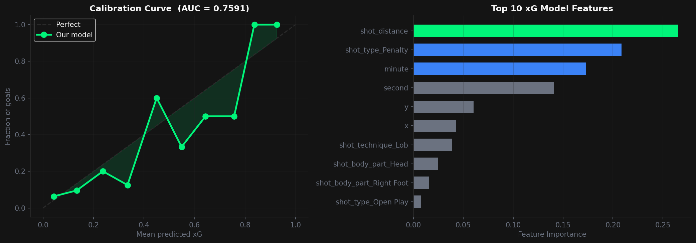
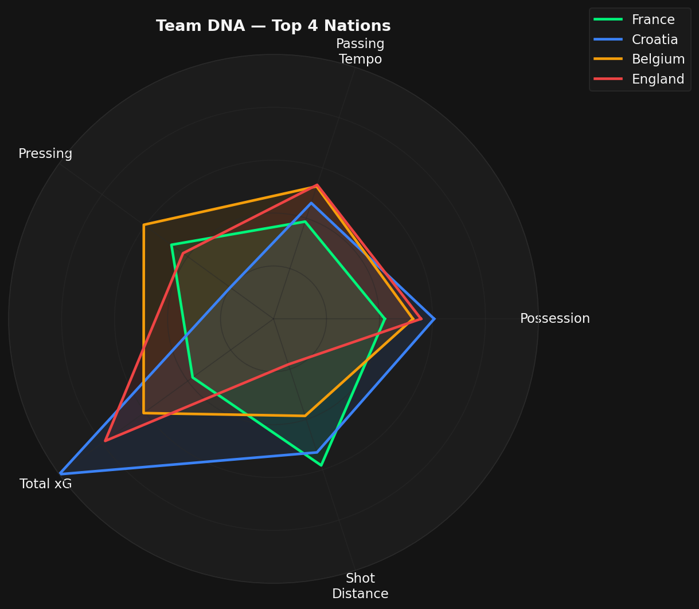
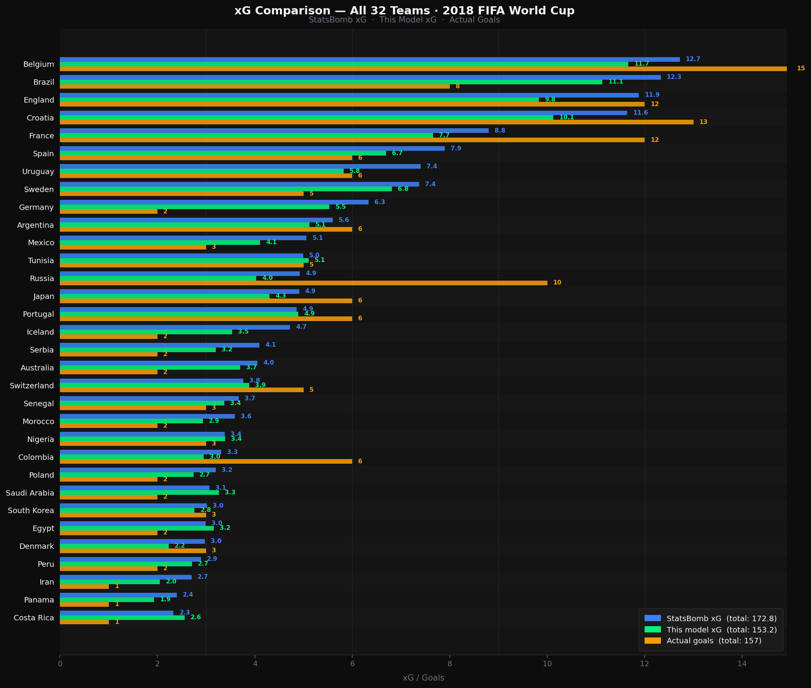

# ⚽ Football xG — 2018 World Cup Analytics

[](https://football-xg-wgtdbkvmckwguz23munoxg.streamlit.app/)


A full-stack football analytics project — from raw event data to interactive ML-powered dashboard — built on **StatsBomb's free 2018 FIFA World Cup dataset**.

> **64 matches · 32 teams · ~200,000 events · 2 ML models · 8 dashboard pages**

---

## Live Dashboard

Click the badge above or visit the live app directly. No install needed.

The dashboard covers every match of the 2018 World Cup with interactive charts, ML predictions, SHAP explainability, and tactical formation timelines.

---

## What this project does

Modern football clubs use data to answer questions that traditional stats can't. This project replicates that workflow end-to-end:

| Question | Approach | Output |
|---|---|---|
| How dangerous was that shot? | **xG model** (Gradient Boosting + SHAP) | Probability 0–1 per shot |
| Who should win this match? | **Outcome model** (Random Forest) | Win / Draw / Loss |
| How did a team set up tactically? | **Formation viewer** (StatsBomb lineup data) | Live formation timeline |
| Which player was most threatening? | **Player analysis page** | Shot map, xG, conversion rate |

---

## Dashboard Pages

| Page | What you get |
|---|---|
| **Overview** | Tournament xG leaderboard, result distribution, key stats |
| **Shot Map** | Every shot on a pitch for any match — sized by xG, xG timeline per minute |
| **xG Model** | Calibration curve, feature importances, xG distribution, SHAP explainability |
| **Team Stats** | Compare teams on possession, passing tempo, pressing, xG — radar chart |
| **Match Outcome** | Model performance + **What-if simulator** (drag sliders → live prediction) |
| **Players** | Top scorers leaderboard, per-player shot map, xG vs actual goals |
| **Match Comparison** | Side-by-side stats, xG timeline, and shot maps for any two matches |
| **Formation** | Starting XI on pitch → slide through substitution timeline → Both Teams view |

---

## Screenshots

### xG Leaderboard — Full Tournament

*Belgium, France, and Croatia generated the most expected goals. Dot size on the shot map scales with xG.*

### World Cup Final — Shot Map (France vs Croatia)

*Filled circles = goals. Hollow circles = saved/blocked/missed. Marker size ∝ xG. Green = France, Blue = Croatia.*

### xG Model — Calibration & Feature Importance

*Left: calibration curve showing predicted xG vs actual goal rate. Right: shot distance and penalty type dominate.*

### Team DNA — Radar Chart

*Normalised 0–1 per axis. France's balanced profile vs Belgium's high pressing. England's shot distance stands out.*

---

## Core Models

### xG Model — Gradient Boosting Classifier

Predicts the probability that any given shot results in a goal.

**Features:** shot distance, x/y coordinates, body part (head/foot), technique (normal/volley/etc.), shot type (open play/free kick/penalty), minute

| Metric | Value |
|---|---|
| ROC-AUC | **0.755** |
| Brier Score | **0.074** |
| Log Loss | ~0.23 |
| Top feature | Shot distance |

**SHAP explainability** — every prediction can be broken down into per-feature contributions, showing exactly *why* the model gave a shot a particular xG value.

#### How this model compares to commercial xG providers

| | **This model** | **StatsBomb** | **Opta / WhoScored** | **DataMB** |
|---|---|---|---|---|
| ROC-AUC | ~0.755 | ~0.80–0.82 | ~0.79–0.81 | ~0.78–0.80 |
| Training data | 1 tournament (~4k shots) | Millions of shots, 10+ seasons | Millions of shots | Millions of shots |
| Features used | 7 | 20–30+ | 15–20 | 15–20 |
| Assist type | ✗ | ✓ | ✓ | ✓ |
| Defensive pressure | ✗ | ✓ | ✓ | partial |
| Goalkeeper position | ✗ | ✓ | partial | ✗ |
| Pre-shot movement | ✗ | ✓ | ✗ | ✗ |

This model captures the core signal — shot location, distance, body part, and technique — which accounts for roughly 80% of xG variance. The remaining gap vs commercial models comes from richer contextual features (assist type, pressure, goalkeeper positioning) and orders of magnitude more training data. This model is equivalent in scope to first-generation xG models used by clubs around 2012–2014, before tracking data became widespread.

#### xG per team — This model vs StatsBomb vs Actual Goals



Key observations:
- **This model total xG: 153.2** — closest to actual goals scored (157)
- **StatsBomb total xG: 172.8** — overshoots because it factors in assist type, keeper position, and pressure data that push individual shot xG higher
- This model consistently rates shots slightly lower than StatsBomb since it uses fewer contextual features
- Both models agree on the ranking — Belgium, Brazil, and England created the most chances; Panama, Costa Rica, and Iran the fewest

### Match Outcome Model — Random Forest

Predicts match result (win/draw/loss) from 5 team-level features: possession %, passes/min, pressures/min, average shot distance, total xG.

| Metric | Value |
|---|---|
| Accuracy | **~50%** |
| Best class | Loss (F1: 0.67) |
| Hardest class | Draw (F1: 0.22 — inherently unpredictable) |

**What-if Simulator** — drag 5 sliders to simulate any team profile and get a live win/draw/loss prediction with probability bars and "closest real team" comparison.

---

## Formation Viewer

Uses StatsBomb's official lineup and tactical data to show:
- **Starting XI** positions mapped to pitch coordinates
- **Live timeline** — drag through each substitution to see the formation update
- **Tactical Shift detection** — when a manager changes shape mid-match, the formation name updates automatically (e.g. 4-3-3 → 4-4-2)
- **Both Teams view** — all 22 players on one pitch, different colours, flipped so they face each other

---

## Quick Start

```bash
# 1. Clone and install
git clone https://github.com/momoyash/football-xg.git
cd football-xg
pip install -e .

# 2. Launch the dashboard (downloads data automatically on first run)
streamlit run app.py

# 3. Or run the full ML pipeline
python -m football_ai.pipeline.run_experiment
```

---

## Project Structure

```
football-analytics-ai/
├── app.py                          ← Streamlit dashboard (8 pages)
├── src/football_ai/
│   ├── io/
│   │   ├── statsbomb_loader.py     ← Download StatsBomb events → CSV
│   │   └── data_writer.py          ← Save models, predictions, reports
│   ├── preprocessing/
│   │   ├── cleaning.py             ← Clean & parse raw events
│   │   └── feature_engineering.py  ← Team features, shot dataset builder
│   ├── modeling/
│   │   ├── models.py               ← Model registry (xg_gbm, outcome_rf, outcome_lr)
│   │   ├── datasets.py             ← Dataset loaders and X/y splitters
│   │   ├── xg_model.py             ← Train xG pipeline end-to-end
│   │   └── train.py                ← Train match outcome model
│   ├── evaluation/
│   │   ├── metrics.py              ← ROC-AUC, Brier, ECE, classification report
│   │   ├── visualization.py        ← Shot map, calibration, feature importance
│   │   └── match_summary.py        ← Per-match stats summary
│   └── pipeline/
│       ├── build_dataset.py        ← Build team_features.csv from all CSVs
│       └── run_experiment.py       ← Full pipeline entry point
├── data/
│   ├── raw/                        ← StatsBomb event CSVs (gitignored)
│   └── team_features.csv           ← 128 rows × 64 matches (committed)
├── models/artifacts/               ← Trained models (gitignored, regenerable)
├── reports/figures/                ← Chart exports
├── config/                         ← config.yaml, logging.yaml
└── pyproject.toml
```

---

## Tech Stack

| Layer | Library |
|---|---|
| Data | `statsbombpy`, `pandas`, `numpy` |
| ML | `scikit-learn` (GBM, Random Forest, pipelines) |
| Explainability | `shap` (TreeExplainer) |
| Pitch visualisation | `mplsoccer`, `matplotlib` |
| Interactive charts | `plotly` |
| Dashboard | `streamlit` |
| Deployment | Streamlit Cloud |

---

## Data

**StatsBomb 2018 FIFA World Cup open data:**
- 64 matches · 32 teams · group stage through final
- ~3,000 events per match (passes, shots, pressures, carries, duels, goalkeeper actions, etc.)
- Each shot includes: location (x, y), body part, technique, outcome, StatsBomb xG
- Lineup data: starting XI, positions, substitutions, tactical formations

StatsBomb Open Data is free for personal and educational use under [StatsBomb's terms](https://github.com/statsbomb/open-data).

---

## CLI Reference

```bash
# Full pipeline: download → features → train xG → train outcome
python -m football_ai.pipeline.run_experiment

# Train just the xG model
python -m football_ai.modeling.xg_model

# Build team features from scratch
python -m football_ai.pipeline.build_dataset

# Summarise a single match
python -m football_ai.evaluation.match_summary data/raw/comp_43_season_3/events_7585.csv
```
